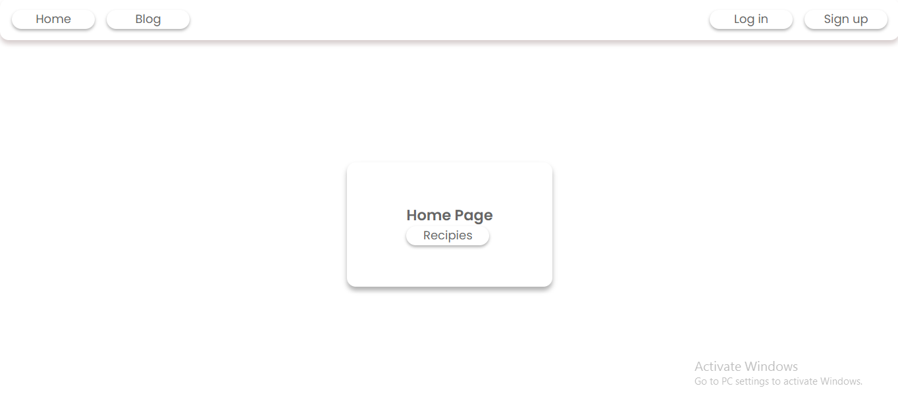
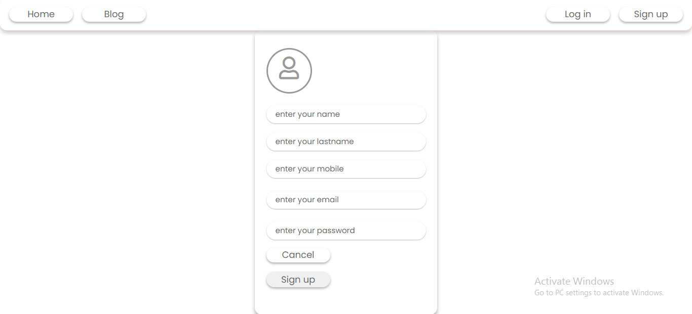
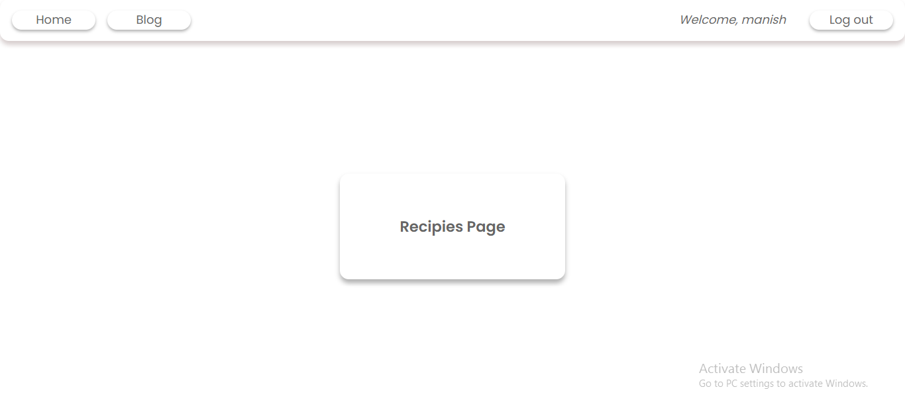
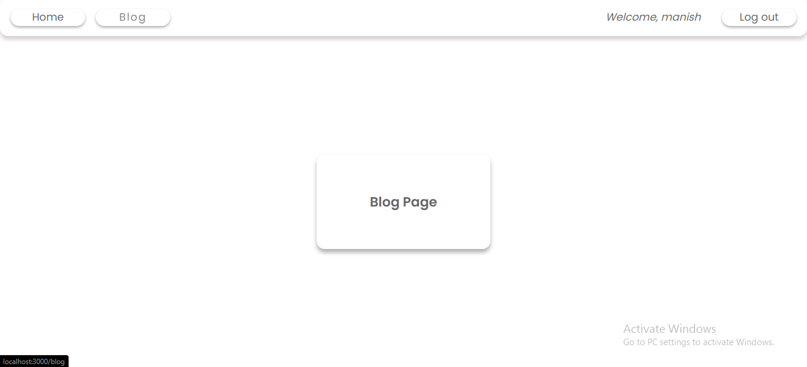

# MEN Boilerplate

# Project Done By:  <a href="https://github.com/Manishkumar62" noreferrer target="_blank">Manishkumar</a>

# Boilerplate for login, signup and logout

## Github Repository

https://github.com/Manishkumar62/MEN-BOILERPLATE

#### User authentication/login system

Authentication is needed for clients to use the application - the primary purpose of the application. 

## Tech Stack

- MongoDB
- Express.js
- Node.js
- Mongoose
- EJS

## What Am I Using and Why ?

```
BACKEND:
  - bcryptjs                    Password encryption
  - dotenv                      Storing sensitive information
  - express                     Backend server
  - validator                   Server side form validation
  - jsonwebtoken                authorization
  - mongoose                    MongoDB ODM
  - cookie-parser               To store the temporary data
FRONTEND:
  - ejs                         lets us embed JavaScript code in a template language that is then used to generate HTML
```

## Introduction to Techs

MEN Boilerplate is an application built on the MEN stack (MongoDB, Express and Node). MongoDB was chosen as the Database Management System (DBMS).

A JSON Web Token strategy for authentication of users. A local username and password authentication strategy is also being considered, to allow users to authenticate using a username and password stored in the Node.js application, to provide a familiar login flow for users of the application. 

Mongoose will be used with our MongoDB implementation, it is an Object Data Modelling (ODM) library for use with MongoDB and Node.js. It assists in managing the relationships between data, provides schema validation and is used to translate between objects in Node.js code and the representation of those objects in MongoDB.

## Wireframes







## Steps to setup

- Download the folder
- Open terminal and run {npm init}
- make file as .env and write {DATABASE_URL = {user database url}}
- then run {npm run devStart}
- Open browser at localhost:3000 and Enjoy

#### Thankyou...
